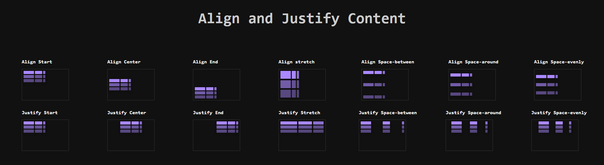

# Align and Justify Content in CSS Grid

This project demonstrates the use of CSS Grid to align and justify content within a grid container. It showcases various techniques for positioning items using the `align-content` and `justify-content` properties.

## Table of Contents

-   [Preview](#preview)
-   [Project Overview](#project-overview)
-   [Features](#features)
-   [Technologies Used](#technologies-used)
-   [Usage](#usage)
-   [Project Structure](#project-structure)
-   [Contributing](#contributing)

## Preview



## Project Overview

This project illustrates the use of align-content and justify-content properties within CSS Grid. These properties control the alignment of grid items along the grid container's block and inline axes. By manipulating these properties, we can achieve various alignment effects such as starting, centering, ending, and distributing space between and around items.

# Properties Demonstrated
- **Align-Content:**

  - start
  - center
  - end
  - stretch
  - space-between
  - space-around
  - space-evenly

- **Justify-Content:**

  - start
  - center
  - end
  - stretch
  - space-between
  - space-around
  - space-evenly

## Features
- Visual examples of each `align-content` and `justify-content` property.
Responsive design to demonstrate behavior at different viewport sizes.
Simple and clean UI to focus on alignment effects.

## Technologies Used

-   HTML5
-   CSS3

## Usage

1. **Clone the repository:**
    ```bash
    git clone https://github.com/your-username/grid-exercise.git
    ```
2. **Navigate to the project directory:**
    ```bash
    cd align-justify-css-grid
    ```
3. **Open the HTML file in your browser:**
    ```bash
      open index.html
    ```
    or simply double-click on the `index.html` file.

## Project Structure

align-justify-css-grid/ <br>
│<br>
├── css/<br>
│   └── style.css   - styles for the grid layout and alignment<br>
├── imgs/<br>
│   └── alignjustify.png  - image for presentation<br>
├── index.html      - main HTML file with grid examples<br>
└── README.md       - project README<br>


## Contributing
We welcome contributions! Please follow these steps to contribute:

1. **Fork the repository:**
2. **Create a new branch:**
    ```bash
      git checkout -b feature/your-feature-name
    ```
3. **Commit your changes:**
    ```bash
      git commit -m 'Add some feature'
    ```
4. **Push to the branch:**
    ```bash
      git push origin feature/your-feature-name
    ```
5. **Create a Pull Request:**


